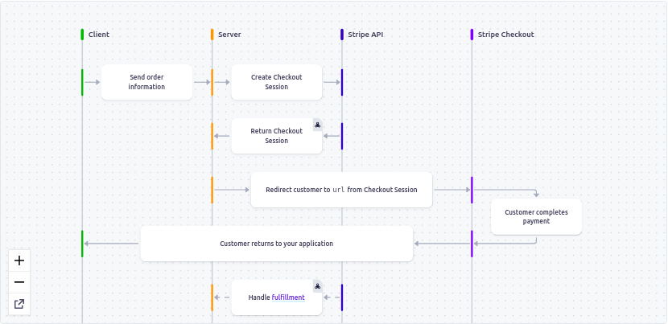

# AMAZON 2.0 USING NEXTJS, NEXTAUTH, TAILWIND, REDUX, WEBHOOKS, FIRESTORE, STRIPE

- Deployment on Vercel: https://iz-commerce.vercel.app/

## Redux

- we have store.js and basket there to implement the redux.

## Hero Icons

- yarn add @heroicons/react
- These are responsible from where we are actually taking search/basket/etc icons

## React Responsive Carousel

- yarn add react-responsive-carousel -- we are using this library over here.
- import { Carousel } from "react-responsive-carousel";
- import "react-responsive-carousel/lib/styles/carousel.min.css"; -- this styling is also needed to be imported there as well!
- This Carousel component we are using and it has many attributes we are using like:
- Autoplay - scroll by itself.
- infinite loop - It just loop back around by its own self once completed the cycle.
- showStatus={true} - shows the status that no. of the images that says 1 of 3 , 2 of 5
- showIndicators={true} - show small dots
- showThumbs={true} - show thumbnails images which are used inside the carousel
- interval={5000} - time bydefault is 3s but now we have given 5000 ms
- We will be having divs inside carousel which will have images inside of them, All that is needed here is that we require div according to our need and those which we will be using here!
- This library has many features included in it like its Responsive, mobile friendly, swipe to slide, mouse emulating touch, server side rendering compatible, keyboard navigation, custom animation duration, Auto play with custom interval, infinite loop, horizontal or vertical directions, Supports images, videos, text content or anything you want. Each direct child represents one slide!, Supports external controls.
- It is the slide show of the components in the images that are changing all the way, and it is called carousel!
- React carousel is a slideshow component for cycling through elements—images or slides of text—like a carousel.
- When ever we are using images tag inside carousel, we must use the tag loading="lazy" their bcz that is necessary their to slow the user experience!

## Server Side Rendering (SSR)

- We want all the products to be server side rendered here from the fakeStoreApi so there must be no latency!
- What we are actually doing is calling the api on server before it shows on the client side; The benefit of doing this is that we will be having all our data confirmed on the client side!
- export const getServerSideProps = async (context) => {
  // calling fakeApiStore -- GET-->> https://fakestoreapi.com/products
  const products = await fetch("https://fakestoreapi.com/products");
  const productResult = await products.json();

  return {
  props: {
  productResult,
  },
  };
  };

- The above code which we used is therefore here which helps us to to SSR.

## react-currency-formatter

- yarn add react-currency-formatter
- import Currency from 'react-currency-formatter';
- npm package for formatting the currency!
- We are using the currency formatter to format the currency!
- <Currency quantity={price} currency='GBP' /> -- this is how we will be using this component!

## Next Auth!

- yarn add next-auth
- We are using Next Auth for the authentication purpose that we wanted to login so authenticating using google in our e-commerce website!
- Now we will be implementing the Auth using prebuild nextAuth that will going to help us to authorize the user and log them in.
- The best part of using the nextAuth Authentication is that we will be having it done on the serverSide rendered.
- [...nextauth].js - this will be the file inside api>auth folder in pages.
- In the above dynamic file we will going to add the logic all the way for the next authentication.
- This file will be responsible to handle all the authentication in the project.
- We have providers in the auth, by these we will going to login and authenticate in the application.
- Created the nextAuth file where we are using the providers that we want to signin with, we will going to configure them!
- we want that when the user clicks account & lists so he has to be redirected to the signin page we have been provided by the nextauth different providers which we will use to sign in into our application.
- import { signIn, signOut, useSession } from "next-auth/react"; -- these are very powerful functions that we will going to use inside the header component that when we click the account we must be directed to the signIn page provided to us by next-auth.
- Simple we have to use the onClick={signIn} function to get on the provided signIn page by the nextauth!
- after clicking signin with google getting this error mismatch uri : Error 400: redirect_uri_mismatch
- after resolving the error we are signed in from google but to get the state of the user data we have to do something as well!
- Inside \_app.js file in pages we have to add the following
- import { SessionProvider } from "next-auth/react";
- We will wrap the whole application by <SessionProvider></SessionProvider> with attribute of session -- what we actually do here is give the access of Authentication to the entire application.
- onClick={!session ? signIn : signOut} -- If there is session so sign out else sign in

- For clientId and secret of the sources to login!
- google credential : https://console.cloud.google.com/apis/credentials?pli=1&project=fir-75e60&supportedpurview=project
- facebook credentials : https://developers.facebook.com/apps/867138024708840/add/
- updated the oAuth uris inside the developer settings in google and facebook to avoid errors!

## 400: redirect_uri_mismatch

- we need to add some data inside the configuration to give access from any point to signIn inside the applicaton.
- Inside of the googlecloud > select project from the dropdown > credentials > Authorised JavaScript origins
- add uri localhost - 3000
- and also the redirect uri, where we get the actual error!
- save the adding things then check again after signing in its working fine!
- also getting the error after deployment for the clientid.
- we were missing something

## getting the error after deployment for the clientid

- Basically we have environment variables we have to upload those environment variables to vercel to avoid the error.
- You need to add the secret NEXTAUTH_SECRET
- Can get one by open up terminal and do "openssl rand -base64 32"
- NEXTAUTH_SECRET="token_generated"

- oAuth settings must be updated all the way inside the google and facebook developer settings!
- to have the smooth login structure all the way

## Firebase

- yarn add firebase
- we will setup firebase for the authentication in the application to save the users that are logged in and have the session running to save those users we will going to have them save inside our firestore!
- Just created a new project on firebase.
- go to settings > click web icon > to register for a web app
- copy config file of the new web app you created!
- created firebase.js file at root and paste the config file there!

### firebase Authentication

- on Firebase console go to authentication > click get started
- now we will have authentication method by which we wanted to sign in there are multiple options available!
- like we click on google and click enable there we get the secret and id after saving, all we have to do is to save that inside the .env.local file.

### .env.local

- This is the file we are using to setup the environment variables! that we will be using inside our nextjs application
- we donot need qoutations "" inside our .env file
- Whenever we update the .env file restart the server!

## Implementing Routing inside Nextjs

- import { useRouter } from "next/router";
- onClick={() => router.push("/checkout")}
- onClick={() => router.push("/")}
- We will be implementing the routing inside of the nextjs, that when ever we click the logo image it takes us to the home!
- When we hit the basket it takes us to the checkout page!

## Redux Toolkit

- import { configureStore } from "@reduxjs/toolkit"; -- global store setup
- import { createSlice } from "@reduxjs/toolkit"; -- we create the slice for the things we wants to change the state for!
- We will have the redux setup to avoid the prop drilling that we will going to pass props to the parent child > to avoid that we will be using the redux.
- we have to create actions that will dispatch and somehow things will going to change all the way!
- what we do is - we dispatch the actions - once action is triggered then we will update the global state.
- we will use Selecter to get the states out of the redux store that is created;
- export const selectItems = (state) => state.basket.items; -- like here we go inside the -- state > basket(slice) > items(initial state)
- we will use dispatc to add action to the basket!
- dispatch(addToBasket(product));
- We are adding the products here inside the action from the payload
- state.items = [...state.items, action.payload];
- We are removing the products here inside the action from the basket using payload
-
- By using the selecter that we created here we will going to have the items for us here all the way!
- we use useSelector hook provided to us
- import { useSelector } from "react-redux";
- const item = useSelector(selectItems);
- we used the product object to add the item to the items state inside the redux.
- We are using the id to remove the item from the items array from the redux.
- const index = state.items.findIndex(
  (basketItem) => basketItem.id === action.payload.id
  ); -- we are getting the id and matching it there!
- Deleting the item from the basket using the id therefore we are using the index, we use splice method to remove that from the basket!
- We can also create a selector with a total from the basket as well, therefore we can use the selector of any kind from the redux!

## Stripe Payment -- https://stripe.com/docs/payments/checkout/how-checkout-works

- yarn add stripe --- for backend apis package
- yarn add @stripe/stripe-js --- for client side package we are using it to load in checkput page
- When we click the button proceed to checkout, we will be redirected to the payment gateway therefore payment will be made.
- Therefore we will be using Stripe session to create the payment and this stuff!
- The user comes to our website they pay on stripe and they comes back therefore we are using stripe here for the card payments!
- This is how stripe actually works:

- This is the complete implementation of the stripe this is how it actually works the whole process!
- Stripe payments are taken using the card stuff that basically receives your payment on your behalf and u collect your money from the stripe!
- stripe is used on serverside while stripe-js is used on the client side .
- It works in such a manner we will going to send the items inside the basket to the stripe and this way it will going to create the stripe session.
- import { loadStripe } from "@stripe/stripe-js"; - for the loaddStripe stripe public access.
- We need to create the free stripe store so we will get the keys to add to our code to access the account.
- We have called the stripe will be needing the backend therefore we require the file inside api folder name create-checkout-session.js where we will handle all the backend inside the nextjs folder.
- We will be using the axios to send the data from the stripe of the network calls.
- We are pushing the information inside the checkout session which is basically the api using the axios and we will be sending the data over there.
- On click to the proceed to checkout we created the function stripe Checkout that basically calls the backend api using axios and there we have backend package stripe and the private key therefore we will get the data from the post request and we will use that data to create the session using that data on the backend.
- To send the data to stripe we need to send the data in a proper format that will be accepted by the stripe therefore it is required that we must send the data in aparticular format to stripe!
- We need to format our data before sending it to stripe because stripe accepts only a particular formated data.
- Moreover in stripe it is required that we must pass the secondary currencies like penny for dollars. sub currency
- In the backend api data what we have done is transform the data according to the stripe format then we will be creating the session on the backend and will be providing the redirect link in case of the payment is successful redirect to the particular page.
- We will have the success url and the cancel url in case of these things get successfull we will be redirected to that particular page else to a differend page if it is successfull.
- We give all the information to stripe and it actually takes us forward or backward according if we pass or fail.

### Stripe Api reference bugs for session code

- https://stripe.com/docs/payments/checkout/migrating-prices?integration=server
- https://stripe.com/docs/checkout/quickstart
- https://dashboard.stripe.com/test/logs?method[0]=post&method[1]=delete&direction[0]=connect_in&direction[1]=self
- We can see the logs as well in the console of the developer environment.

- If we redirected to the page of the stripe session it will be our success cause we pass right paarmeters there inside the parenthesis all the way therefore we have done all this work by reading the docs.

- To Test the card payment developer test code is
- 4242 4242 4242 4242
- 04 / 24 - 424

## WebHooks

- when we click to the proceed to checkout page it redirects us to the stripe session that was created.
- In the stripe session we add card details therefore over there.
- If the payment was successful it takes us to the success page else it takes us back to the checkout page.
- So here the WEB-HOOK that we require is we want that when we move to the stripe session, we must add all the products to the database firebase, If the customer donot pay the payment therefore we he should return the products must be there all the way in his basket and the products are coming to his basket from the database.
- This will going to allow the products to show when the customer returns on the website until he/she removes it from the cart.

- ===============================================================================================================================

- Till now there is nothing listening on the webhook so we want to fire an event to the webhook that should listen from the session page and we will be applying the logic over there.
- Stripe works with the webhook and to save our data into the database it is required for us to create a webhook, and there we will going to put the logic in and that will save our data in the firestore.
- We have to add webhook url endpoint in the console as well.
- like    ---  url/api/webhook

- webhooks are provided by the stripe payment

### api/webhook.js  -- https://stripe.com/docs/webhooks

- created the file inside the api folder, as webhook is actually the backend structure we are just combining this using the stripe api listener.
- yarn add micro           --  to generate the certificate 
- yarn add firebase-admin        --  to access the firebase from nodejs backend

- we will go firebase console > setings >service account > there we will download the file
- we will have the permission.josn file on the root which basically has the service accounts credentials, which we will going to use inside webhook.js file inside api folder!  
- Using the app if there on the firebase console else Initializing the app using the service account file.

## Stripe - cli to implement webhook. -- https://stripe.com/docs/stripe-cli

- From the stripe session we want an event to fire and go to the webhook and there, we will handle the logic to save data inside firestore.
- Therefore to do this we require to work with STRIPE-CLI.
- So we will going to install it - https://stripe.com/docs/stripe-cli
- Install the stripe cli and then login
- Now we will create a webhook using the command -- stripe listen --forward-to localhost:3000/api/webhook
- after running the command we will have a secret but the pat what we have api/webhook that is not created till now.
- This secret will change once the terminal session finishes.
- We will paste this secret inside the .env file in STRIPE_SIGNING_SECRET.

## creating success page

- Here we will be redirected if the stripe payment is succesfull all the way.

### Extra Informtion

- We have tailwindcs and redux already activated in this starter templete all that is require we will be going to add the features and functionalities inside of it!
- Applying emmet in settings, if we wanted to have the shortcuts over here!
- Auto Rename Tag - extention to automatically rename the tags!
- Image tag iptimize the image and serves them in the most optimize way!
- while using the link inside the src folder in image tag it is giving error that the links are not configured!
- created next.config.js file and there used the links which we will be using to call the images from!
- bg-amazon_blue - this is coming as the background color for us here as we have already setup it inside of the tailwind.config.css
- hidden sm:flex -- it is hidden bydefault but once it reaches the small screen it becomes flex.
- flex-grow -- property allows it to take as much room as possible when screen is getting bigger!
- flex-shrink -- The flex-shrink CSS property sets the flex shrink factor of a flex item. If the size of all flex items is larger than the flex container, items shrink to fit according to flex-shrink .
- focus:outline-none - to avoid blue outline that is there when we focus on!
- we can create our own utility classes intailwindcss in global.css by @layer.
- we just have to use the @apply just there so that to create our own utility class in the global.css and then use them inside the components!
- hidden md:inline - hidden opposite is inlne, once it is hidden but once medium screen is there make it inine.
- whenever we want something to be absolute so we wants its parent to be relative else it will be relative to that whole entire page!
- max-w-screen-2xl - It is the max screen we are giving to a container it will not going to pass it here all the way!
- mx-auto - this brings everything to the center horizontally
- bg-gradient-to-t from-gray-100 to-transparent bottom-0 z-20 - to use the gradient color in tailwind we use!
- bottom-0 -- The bottom property is used to set the value of the position of an element from the bottom of the viewport. If the position value is fixed or absolute, then the element adjusts its bottom edge with respect to the bottom edge of its parent element or the block that holds it. It holds the bottom of the screen there and gives the bottom their as well!
- key - whenever we are mapping in react key represents the id or the place where it is situated in an array which we mapped so it is needed else it gives us warning!
- {Array(rate)
  .fill()
  .map((\_, i) => (
  <StarIcon className='h-5' />
  ))} -- creating an array from a number to be mapped!
- require("@tailwindcss/line-clamp" -- we have this line clamp inside tailwind config so for long descriptions we will be going to use it all the way! we want to clamp a line after 2 line means it will show ...
- focus:outline-none focus:ring-2 -- when focus it ring and outline becomes none as well!
- active:from-yellow-500 -- It means when clicked it means it is active!
- grid-flow-row-dense -->> row dense. Places items by filling each row, and fill any holes in the grid. Demo ❯ column dense. Places items by filling each column, and fill any holes in the grid.
- grid grid-flow-row-dense md:grid-cols-2 lg:grid-cols-3 xl:grid-cols-4 ---->>> creating the products into the grid!
- -mt-52 --> negative margin top will take it to the top instead give margin to it!
- col-span-full -- gets the whole space of the line!
- products.slice(0,4) -- It breaks the array and slice it shows the first four and after that we show the ad.
- col-span-2 -- 2 columns ki jaga lega yh span-2!
- slice -- cuts the array from the initial value to a particular value and by which it shows the data to that index like products.slice(0,4).map() -- phr uske bd uspe map chala rhe hain slice krne ke bd!
- by using grid-flow-row-dense -- it uses all the space else if we donot use that so it leaves a big space then!
- background gray pe white card bhi sahi lgrhe hain acha lgta hai
- In nextjs we have backend folder there as well bundle that is in pages folder and the folder is called the "api".
- This api backend folder will be used to fetch the apis of the backend or to authenticate!
- we donot require "" insdie the .env files
- Whenever we update the .env file restart the server!
- text-3xl border-b pb-4 -- To add border bottom
- grid grid-cols-5 -- created the grid with 5 coloumns but the structure for us is like this that we want first and last coloum to take 1 1 space while the middle one takes 3 coloumn spaces therefore we will say for the middle "col-span-3" -- it means it takes 3 coloumns space.
- col-span-3 -- It takes three coloumn space
- line-clamp-3 -- iska mtlb hai 3 line ke bd ... dot ajaeinge
- my-auto -- centers in the y axis by this
- justify-self-end -- in the given space use that particularly
- whitespace-nowrap -- It will not have white spaces extra
- Here we are using the reduce functon to create the total price inside the reducer function.
- role='link' -- We add this attribute inside the checkout button there we are linking the page to stripe!
- Anything underneath the api folder is a backend code.
- We are using axios for the network call to send the data
- implecet return mtlb circle braces ke andar curly braces hnge to ise khte hain implecet return.
- Whenever we update te .env file we should restart the local server.
- If req.method==="POST"  --- we check POST, GET request in nextjs like this.
- In api folder inside nextjs we have all the backend code functionality therefore the packages used inside the api folder are of the nodejs like we are using firebase-admin, It has all the accessibility for the firebase.
- orderBy - orderBy is the firebase function used for the timestamp.
- yarn add moment   -- library for the moment of te epoc date structure
- flex-1  -  to take the majority of the room.
- truncate - if it is bigger start cut it off
- overflow-x-auto  -- it means that when items start to become more so scroll automatic on x axis
- We fetch things on the server to avoid te glitch! 

